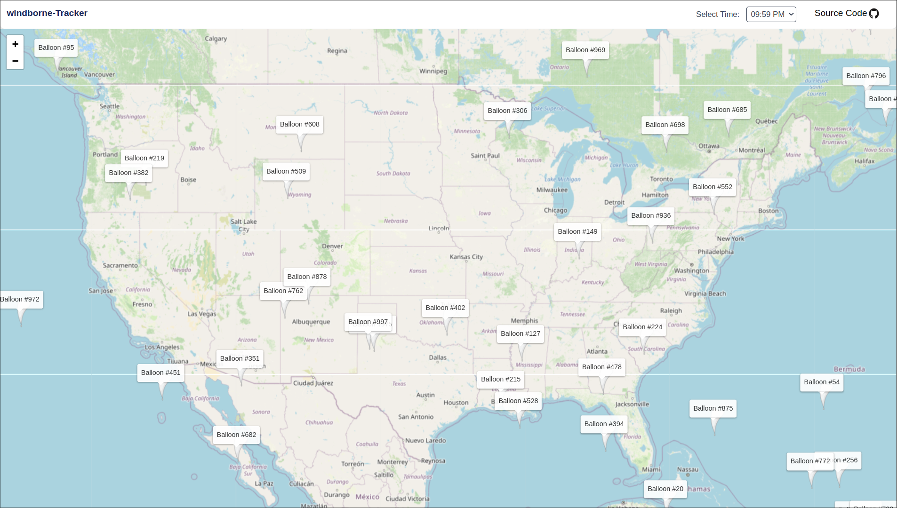

### Windborne Simulator

This interactive web app visualizes WindBorne Systems’ live balloon data on an interactive world map. Users can select any hour from the last 24 to view balloon positions at that time.

### Tech Stack
Framework: Next.js (App Router)
Map Library: React Leaflet + Leaflet
Styling: Tailwind CSS

### APIs Used
- **WindBorne Systems Balloon API**

  [https://a.windbornesystems.com/treasure/{00}.json](https://a.windbornesystems.com/treasure/{00}.json)

  Used to fetch hourly balloon positions.

- **OpenStreetMap Tile Server**

  Used as the base map layer for geospatial rendering.

### Features
- Hour-based balloon filtering (00–23)
- Custom balloon icons with tooltips
- Time conversion from offset to local hour
- Fullscreen loading overlay

> I chose OpenStreetMap’s public tile server as the external API to provide real-world geospatial context to WindBorne’s balloon positions.
